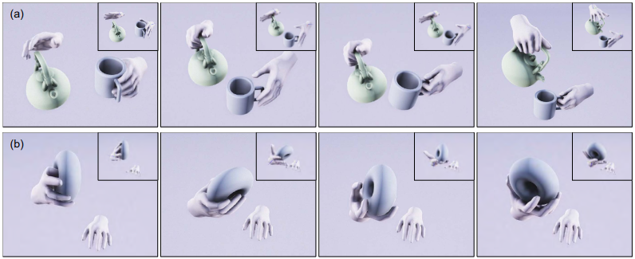

태그: #paper
출처: 
저자:
url:https://research.facebook.com/file/593672515280443/ManipNet-Neural-Manipulation-Synthesis-with-a-Hand-Object-Spatial-Representation.pdf
인용:
위치:
연결문서: [[Hand_Animation_Paper]]

# 개요

- ManipNet이 무엇인지에 대해서 좀 리뷰를 해야 함.

- ManipNet의 code 테스트를 해야함

# 내용

## Introduction

-  we choose to learn natural mainulation behaviors directly from data using a deep neural network given the explosive success of deep learning
	- 딥러닝을 이용해서 자연스러운 행동 배합을 배우겠다는 뜻.

- manipulation은 단순한 물건의 특징(모양, 크기, 기능) 뿐만 아니라 의도 , hand anatomy 심지어 사람의 선호도에 따라서 다름 

- Real-time Hand-object interaction motion capture는 가능하지만, 넓은 공간에서의 캡쳐는 여전히 불가능함

- 저자는 적은 수의 물건 모양을 학습 시키는 것을 통해 기하학적  다형성을  배우는데 초점을 맞추고 그것을 목적이 있는 물체를 잡는 애니메이션을 넘어 사람처럼 자연스럽고 의도하지 않는 방법으로 하는 것을 목표로 확장시키는 것에 초점을 맞춘다.

-  메인 아이디어는 손과 물체 사이의 공간적 관계의 특성을 사용하는 것 (biomechanice literature 관점으로 가는 듯)

- coarse representation for the global object shape -> dense representation for local geometric details of the object surface whend  hand is in close proximity (근접함에 따라서 detail을 변화시킨다.)

- represent 3D geometry for neural networks 는 다음과 같은 방식들이 주어져 있다.
	- voxel occupancy grids
	- signed distance fields
	-  and point samples
	- 저자는 중요 정보들을 캡처하면서 feature dimention을 줄인다고 한다.( overfitting을 피하기 위해.)

- 저자는 저해상도의 voxel occupancy grid 사용해서 object shape를 표현한다.  여기에 손과 물체 표면 사이에의 distance samples가 디테일을 잘 캡쳐하는 low dimensional signal이다 

- finger pose 의 예측은 neural network를 통해서 배웠다.

- Control signals are 6D trajectories of the wrist and of the object

- deep learning 로 일반화 잘하기 위해 덜 애매한 input representation를 해야했고,  그 결과가 한개의 손 (오른손) - 물체 이 조합으로 건들게 했다. 그다음 다른 손과 물건을 학습시키는 것을 시킴

- 차주는거 성공했다함

요약하자면 다음과 같다

• A neural network-based motion synthesis system that can
generate detailed finger motions for one-/two-hand dexterous
object manipulation,
• a representation of hand-object spatial relation that enables a
neural network to generalize manipulation motions to a wide
range of object shapes and manipulation tasks,
• a hand-object interaction motion dataset that includes de-
tailed finger motions and dexterous manipulations of 16 man-
made objects

## System OverView

- 전체적인 시스템은 다음과 같다. -